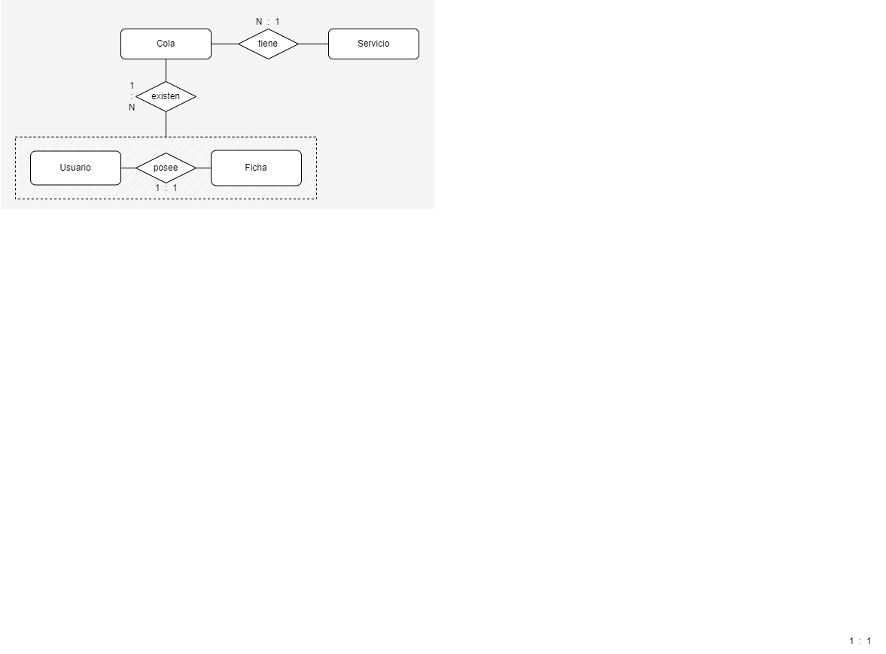

# API QUE MANEJA EL FLUJO DE UN FILA VIRTUAL
La API funciona con la siguiente estructura.
* SERVICE: Son los servicios que se ofrece la empresa o compañia para hacer la cola virtual. Contiene (ID, descripcion) 
* QUEUE: Es la cola de los servicios, para cada fecha existe una nueva cola. Contiene (ID cola, ID servicio, fecha, cantidad en cola)
* TOKEN: Es la ficha que se tiene para cada cola y para un usuario. Contiene (ID Cola, CI <user>, numero de ficha)  
* USER: Son los que pueden adquirir una ficha (token). Contiene (CI, nombre, fecha de nac)
La relación de la base de datos se muestra en la siguiente imagen.

